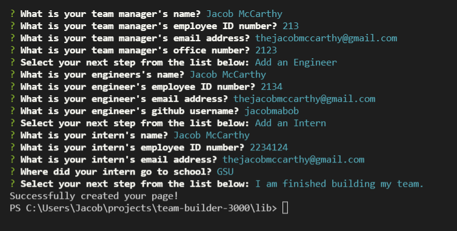
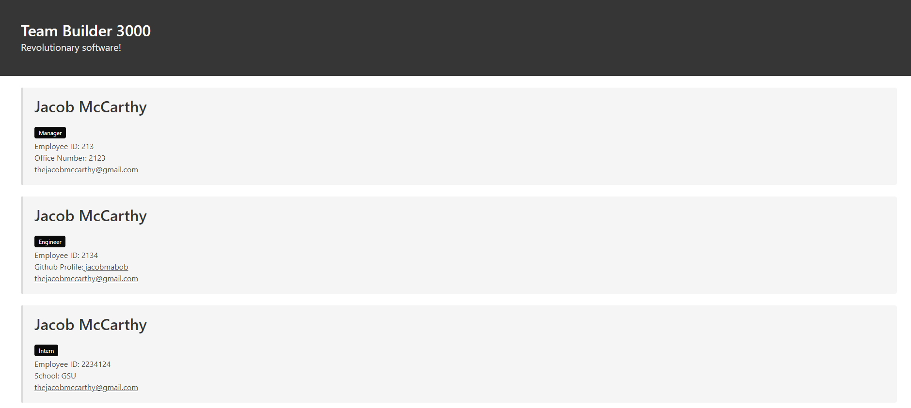

 # Team Builder 3000

## Table of Contents
  
  - [Description](#description)
  - [Installation](#installation)
  - [Usage](#usage)
  - [Tests](#tests)
  - [Questions](#questions)

  ---

  ## Description

  The Team Builder 3000 is a command line application built with nodejs, using the inquirer and jest packages. Through a series of prompts, the user is able to create a profile of their developement team, which is then displayed in a dynamically generated HTML document complete with styling. 
  ---

  ## Installation

  Simply clone the repo to your machine and you're good to go. 

  ---

  ## Usage

  Begin the application by running the command `npm start`. Team Builder 3000 will then ask you some questions about the individual members of your team. A team manager is required, then you can add as many engineers and interns as you like. After you've finished building the team, select "I am finished building my team." and your webage will be generated. Each employee will have a card displayed on the HTML page displaying their relevant work information. Styling provided by bulma!

  
  
  
  [Walk-Through Video](https://watch.screencastify.com/v/3O923usMPmfh48G9IbFG)
  ---

  ## Tests

  Tests are included for the Employee class and the Manager, Engineer and Intern subclasses. They simply check that the constructors are processing the input parameters properly.

  Run tests using the command `npm test`

  ---

  ## Questions
  Have any questions? Feel free to check out my github or send me an Email!

  github.com/jacobmabob  
  thejacobmccarthy@gmail.com